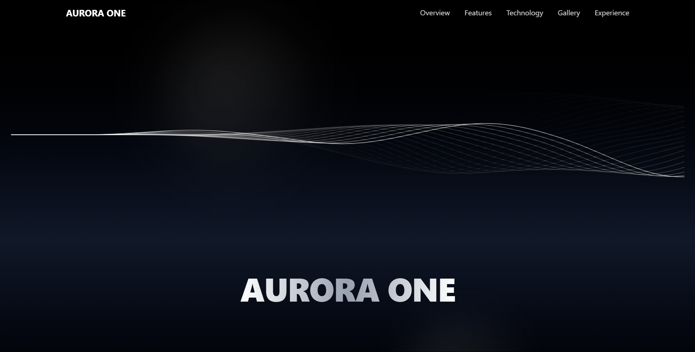
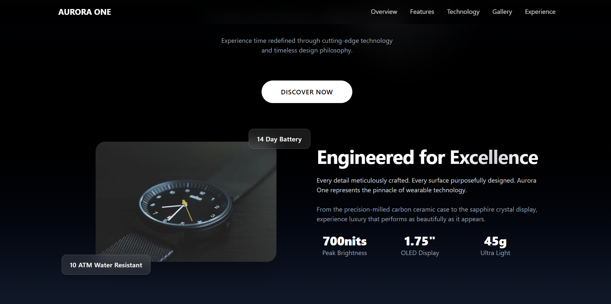
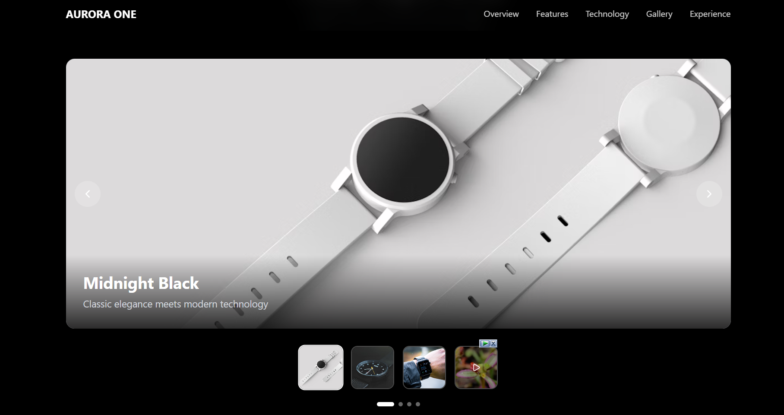

# Aurora One Smart Watch ⌚

A sleek product showcase webpage featuring the Aurora One Smart Watch - where premium design meets cutting-edge technology.

## 📋 Overview

This is a modern, responsive product overview webpage designed to showcase the Aurora One Smart Watch. The site presents the smartwatch's key features, specifications, and premium design through an engaging and interactive user interface. Built with performance and visual appeal in mind, the webpage provides potential customers with a comprehensive look at this advanced wearable technology.

The Aurora One Smart Watch features a stunning 1.43" AMOLED display, military-grade toughness, comprehensive health monitoring, and seamless connectivity - all packaged in a sophisticated design that complements any lifestyle.

## 🚀 Live Demo

🔗 **[View Aurora One Showcase](https://aurora-peach-tau.vercel.app/)**

Experience the interactive product presentation and explore all the features of the Aurora One Smart Watch.

## 🛠️ Technologies Used

### Frontend Framework
- **React.js** - Component-based user interface library
- **Vite** - Fast build tool and development server

### Styling & Design
- **Tailwind CSS** - Utility-first CSS framework for responsive design
- **CSS3** - Advanced styling and animations
- **Responsive Design** - Mobile-first approach for all devices

### Development & Deployment
- **JavaScript (ES6+)** - Modern JavaScript features
- **Vercel** - Deployment and hosting platform
- **Git** - Version control system

### Additional Features
- **Interactive Components** - Engaging user interactions
- **Smooth Animations** - Enhanced user experience
- **Optimized Performance** - Fast loading and smooth scrolling
- **SEO Friendly** - Optimized for search engines

## 📸 Screenshots

### Hero Section

> Stunning hero section showcasing the Aurora One Smart Watch

### Product Features

> Detailed feature highlights with interactive elements

### Design Gallery

> Different color options and design variations

---  

⭐ Star this repo if you love the Aurora One Smart Watch showcase!
